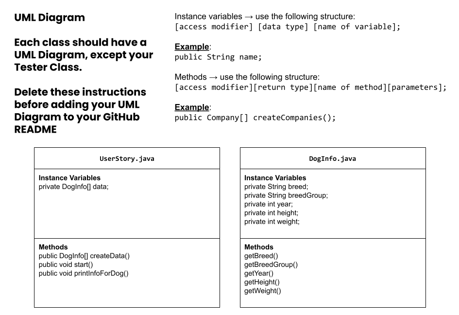

# Unit 3 - Data for Social Good Project

## Introduction

Software engineers develop programs to work with data and provide information to a user. Each user has different needs based on the information they are looking for from data. Your goal is to create a data analysis program for your user that stores and analyzes data to provide the information they need.

## Requirements

Use your knowledge of object-oriented programming, one-dimensional (1D) arrays, and algorithms to create your data analysis program:
- **Write a class** – Write a class to represent your user or business and store and analyze their data with no-argument and parameterized constructors.
- **Create at least two 1D arrays** – Create at least two 1D arrays to store the data that your user needs information about.
- **Write a method** – Write a method that finds or manipulates the elements in a 1D array to provide the information your user needs.
- **Implement a toString() method** – Write a toString() method that returns general information about the data (for example, number of values in the dataset).
- **Document your code** – Use comments to explain the purpose of the methods and code segments and note any preconditions and postconditions.

## User Story 

Include your User Story you analyzed for your project here. Your User Story should have the following format: 

> As an young woman searching for her first dog,   
> I want to do research on dog breeds,   
> so that I can fulfil my childhood dream of having the perfect companion.

## Dataset 

Include a hyperlink to the source of your dataset used for this project. Additionally, provide a short description of each column used from the dataset, and the data type. 
 

Dataset: https://docs.google.com/spreadsheets/d/1H5PXIV7F8tVom4Zcc1-wX65Ku-RtyRKkzeWeGxpka_4/edit?gid=622583278#gid=622583278 
- **Breed** (String) - name of the dog breed 
- **Height** (int) - breeds height in inches 
- **Weight** (int) - breeds average weight in pounds 
- **Year** (int) - average life span/age in years 
- **Breed Group** (String) - group that the breed falls into

## UML Diagram 

Put an image of your UML Diagram here. Upload the image of your UML Diagram to your repository, then use the Markdown syntax to insert your image here. Make sure your image file name is one work, otherwise it might not properly get displayed on this README. 

 

## Description 

In this project, my partner and I used a dataset from code.org in order to produce a program that displays information about a plethora of dog breeds. The user was supposed to be able to type a dog breeds name into the console and then the program would return basic information about the dog breed chosen. Including height, weight, type, and more. We used the Scanner to go through the different categories of data to be displayed and evenetually put them together when the data is printed out in the console. The user story was to help them find a dog breed that is right for them. This does that by letting the user explore dog breeds until they find one that they like the sound of.
